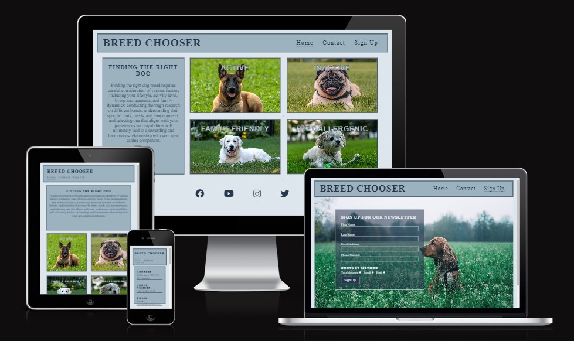
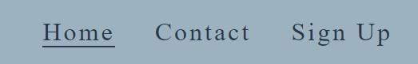
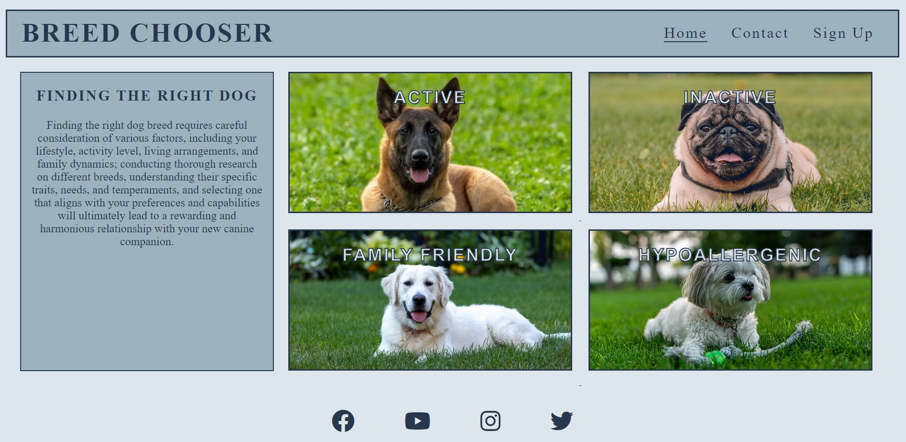
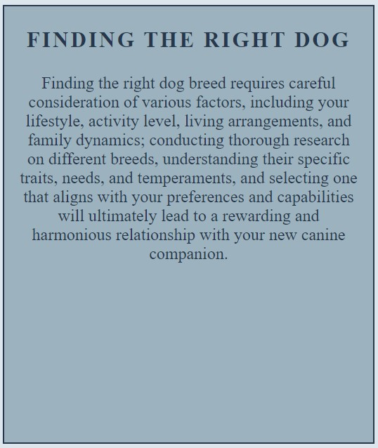
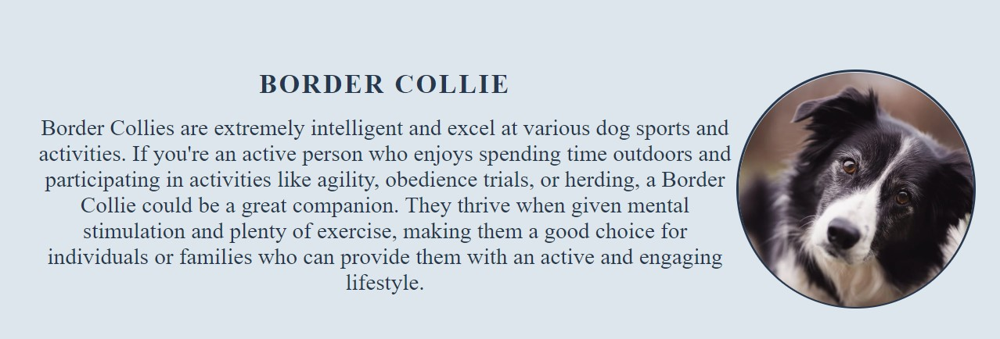
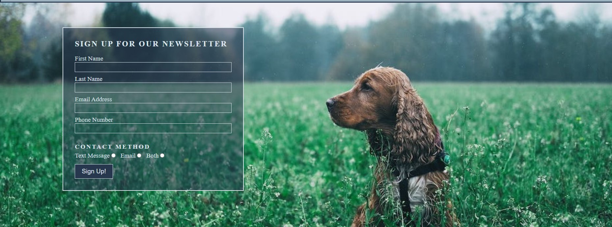

# BREED CHOOSER

Breed Chooser is a website dedicated to everyone who has a problem choosing a dog breed that suits their needs and conditions. It provides users with information about different breeds and offers a way to sign up for a newsletter.

Visit [Breed Chooser](https://tossan99.github.io/dog-lovers/) 

## Features

### Existing Features

- __Logo__

- The Logo clearly shows right away that the user have arrived at the right website.
- The text is large and imply the purpose of the website.

- __Header__

- The header keeps consistent design and dimensions throughout all pages to make navigating the different pages smoother and more enjoyable.

- __Navigation Bar__

- The navigation bar is available on all pages and as a part of the header keeps consistent design and dimensions.
- This feature allows users to easily navigate all pages without having to use the "back button". 

- __Landing page__

- The landing introduce the user to the purpose of the website right away and have all information and features the user need to navigate the site.
- This section immediately catches the user's attention with a few cute dog images and the interactive mouse hoovering.
- This section is the hearth of the website and is used to navigate the information provided.

- __Information Box Aside__

- The information box suggests a few factors to consider when choosing what kind of breed to get.
- It's dimensions and design is also consistent with some of the other pages to make navigating the different pages smoother.

- __Active, Inactive, Family Friendly and Hypoallergenic__

- These pages provide the user with the main information about the different dog breeds and also displays images of the breeds so the user can recognize them.

- __Contact__

- The contact page provides address, phone number, email and an interactive map that shows our location.

- __Sign Up__

- The sign up page feutures a beautiful image of a dog on a field.
- On this page the user can sign up for our newsletter and choose to recive it through Email, text message or both.

- __Footer__

- The footer section provides the user with social media links to futher interact with us through other mediums.
- When hoovering over the social media icons they light up with their original logo color and grow in size.
- This design makes the footer both very satisfying to interact with and helps the user recognise the company logo.

### Features Left to Implement

- I would love to figure out a way for the user to navigate between the breed categories without having to go back to the home page.

## Testing

### Responsiveness

### Validator testing

- HTML
  - All html pages have passed through the official [W3C validator](https://validator.w3.org/).
- CSS
  - The CSS code have passed through the official [(Jigsaw) validator](https://jigsaw.w3.org/css-validator/).

### Accessibility

- All pages have been checked with lighthouse and passed with a good score
[Lighthouse](/assets/images/l)

### Unfixed Bugs

- When hoovering over any social media icon in the footer the scroll bar disappears and does'nt return until the page is reloaded.

## Deployment

The whole project was deployed to GitHub pages using the Main Branch source.

-All code and files has been submited to Github by using the Git commands "git add", "git commit" and "git push"
- GitHub pages can be reached by opening the settings tab and then open the pages tab.

## Credits

### Content

- The code snippet for the different zoom effects is taken from the "[Love Running](https://www.youtube.com/watch?v=F0XY13Fjblw&t=77s)" walkthrough project.

- The code to hide the scrollbar is from this [tutorial](https://www.w3schools.com/howto/howto_css_hide_scrollbars.asp).

- The google map was generated through [MAPS.ie](https://www.maps.ie/create-google-map/).

- The social media icons are taken from [Font Awsome](https://fontawesome.com/).

- The outline effect on the headings inside the dog boxes is from this[YouTube](https://www.youtube.com/watch?v=Hx1p1vQeHCg) tutorial.

- The color palette used is from [Color Hunt](https://colorhunt.co/palette/27374d526d829db2bfdde6ed).

- The fonts used is from [Google Fonts](https://fonts.google.com/).

- All text content about dogs and dog breeds was generated by [Chat GPT](https://openai.com/blog/chatgpt).
### Media

- All images used were taken from [Pexels](https://www.pexels.com/).

